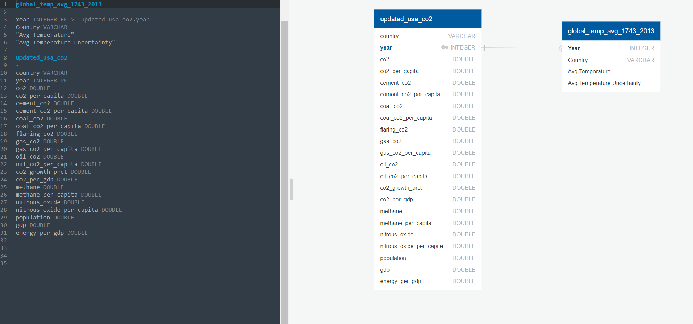

# Rising Temperatures: CO2 and Company
Using complex data to help uncover the leading causes in the rise of temperatures by various CO2 pollutants in the United States

## Topic
We are hoping to explore the relationship between CO2, the climate, and other factors (nitrous oxide per capita, GDP, population, etc.) to predict future CO2 levels/temperatures and consequently understand the how these things will affect our habitat in the years to come. We chose this subject as climate change is an unavoidable part of life and being able to understand the ways in which this phenomenon will unfold will be important when planning for the future. With this exploration we plan to understand how CO2 emissions and other related factors will affect our habitat.

## Question We Would like to answer:
- Do various sources CO2 emissions contribute to the rise in temperature in the US?

## Sources of Data:
- [Kaggle: Earth Surface Temperature Data](https://www.kaggle.com/datasets/berkeleyearth/climate-change-earth-surface-temperature-data)
- [Github: CO2 Emissions](https://github.com/owid/co2-data)

## Preliminary Data Preprocessing
#### Temperature Data
To narrow our focus for our analysis and machine learning model, we filtered the data to only include the US. Next we extracted the year and month from the date column. This cleaned dataset will help us look at yearly temperature data in the US.

Initial dataset:

Cleaned dataset:

#### CO2 Emissions Data
To narrow our focus for our analysis and machine learning model, we filtered the data to only include the US. Next we dropped all columns with more than 90% NaN values. To further narrow our focus, we dropped all columns with non-beneficial data. This brought us down from 25191 rows × 60 columns to 221 rows × 22 columns

Initial dataset:

Cleaned dataset:

## Database Preparation

Once we had the datasets we wanted to use, we could then endeavor to join them together for the machine learning model. Before joining them with SQL, we had to reframe the “Global Land Temperatures” dataset. The “Global Land Temperatures” dataset recorded its information by year and month (ie. 199002, 199003,...) and by state in the USA; the “CO2 and Greenhouse Gas Emissions” dataset recorded their information by year and by country. This discrepancy prevented us from simply joining the two tables via SQL. The decision was made to first: convert the metric of time from "year and month" to simply "year" and to second: convert the data from being recorded by state to being recorded simply by country; both steps had to be done to the "Global Land Temperatures" dataset. The code for this step can be found in the repository and the following are images from this process:  

 

This left us with two datasets that we could now join through SQL. The following is an image of the ERD: 

The two files were imported into PGAdmin and joined with SQL. "Global Land "Temperatures" and "CO2 and Greenhouse Gas Emissions" were joined on the shared column of "year" and then saved into a file. The following is the code for that query:  

Now, we had a dataset that could be input into our machine learning model.

## Machine Learning Model

During the Machine Learning process we used 4 Supervised Machine Learning processes to evaluate our overall data and to determine which process best suits our data.

### **Logistic Regression Model**

In the process of using the Logistic Regression Model the overall result of the accuracy score was 27%. This did not meet our minimum 70% accuracy score to determine whether various CO2 factors contributes to the rise in temperature.

### **OLS Regression Results**

Based on our OLS Regression Results our R-squared predicted that there is a 40% Linear Model influence in various CO2 factors contributing to the rise in temperatures.

### **Random Forest Classifier Results**

Based on our Random Forest classification algorithm we used to.  One of the biggest advantages of random forest is its versatility. It can be used for both regression and classification tasks, and it’s also easy to view the relative importance it assigns to the input features.

Random forest is also a very handy algorithm because  produce a good prediction results and in our data we used to see whether factors of CO2 contribute to the increase in temperatures. Based on our Random Forest accuracy it resulted in a 63% accuracy score. 

## Dashboard Tableau
We used Tableau to create and host our dashboard. The file is also stored in the repository.  
[Tableau Dashboard](https://public.tableau.com/app/profile/jun6899/viz/ChangesinAverageUSTemperaturesCO2andCompany/Dashboard1)

## Visualizing the Data

Below shows the United States 12 month heat forecast. It also displays the Average Temperature increasing from 1750 to 2013.

=======

